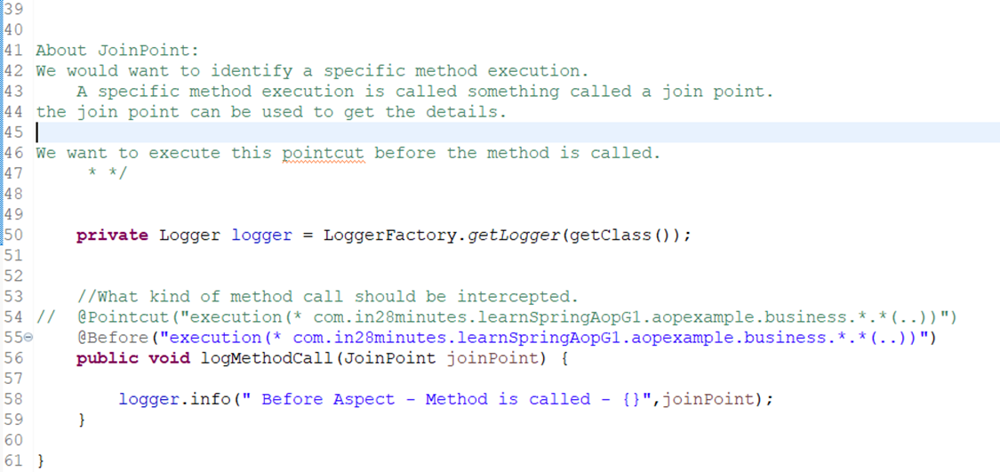

# Spring3_RangaPart2
# Section-15
# 215. Step-1: Overview

# 216. Step-2 What is Aop?

# 217. Step-3 Creating Project

# 218. Step-4 Setting up Spring Component for Spring AOP.

# 219. Step-5: Creating AOP Logging Aspect and Pointcut

# 220. Step-6: Understanding AOP terminology

# 221. Step-7: Exploring @After, @AfterReturning and @AfterThrowing AOP annotations.

