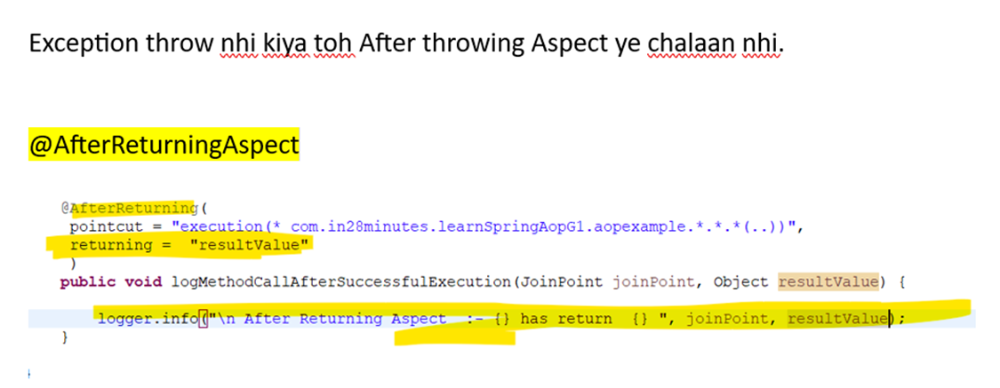
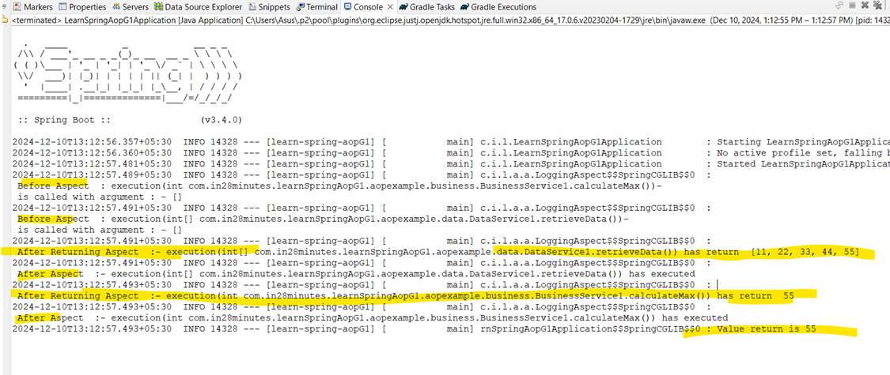
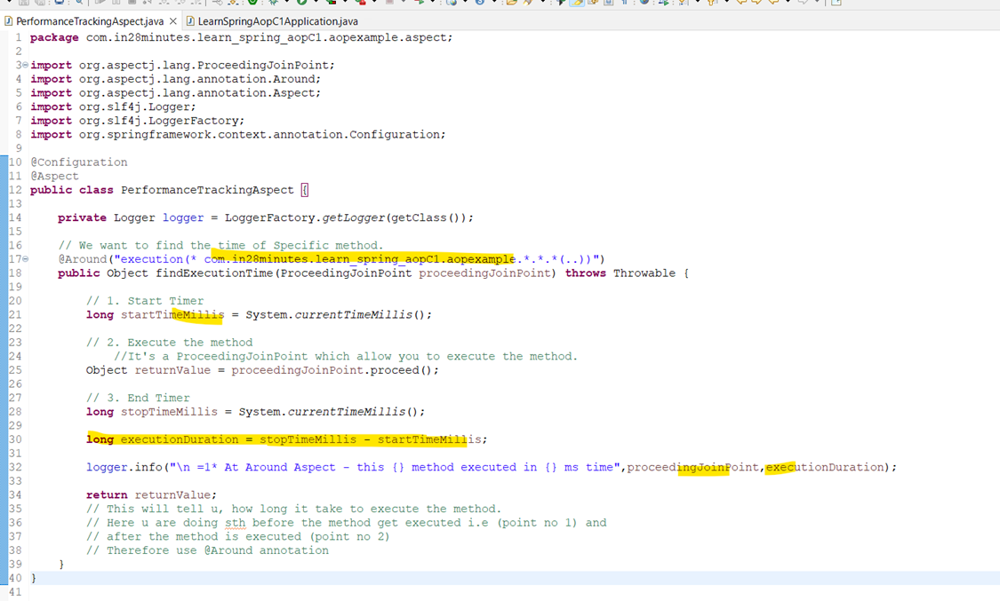
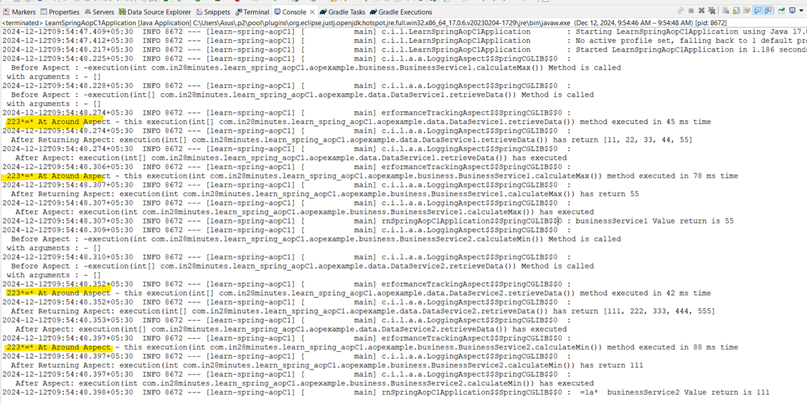

# Spring3_RangaPart2
# Section-15
# 215. Step-1: Overview

# 216. Step-2 What is Aop?

# 217. Step-3 Creating Project

# 218. Step-4 Setting up Spring Component for Spring AOP.

# 219. Step-5: Creating AOP Logging Aspect and Pointcut

# 220. Step-6: Understanding AOP terminology

# 221. Step-7: Exploring @After, @AfterReturning and @AfterThrowing AOP annotations.

# 222. Step-8: Exploring Around AOP annotations with Timer Class

# 223. Step-9: Creating Common Pointcut Definitions

# 224. Step-10: Creating Track Time Annotation

# 225. Step-11 

# Quiz-12

# Section-16. Learning Gradle
# 226. Code backup
https://github.com/in28minutes/master-spring-and-spring-boot/tree/main/82-gradle
# 227. Step-1 Started with Gradle

# 228. Step-2 Creating Spring Boot Project with Gradle

# 229. Step-3: Exploring Gradle build and Setting files

# 230. Step-4 Exploring Gradle Plugins for Java and Spring boot

# 231. Step05: Maven or Gradle

# Quiz-13
